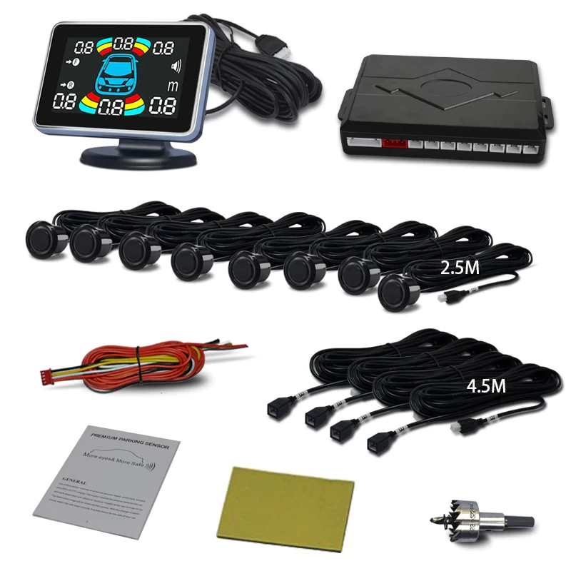
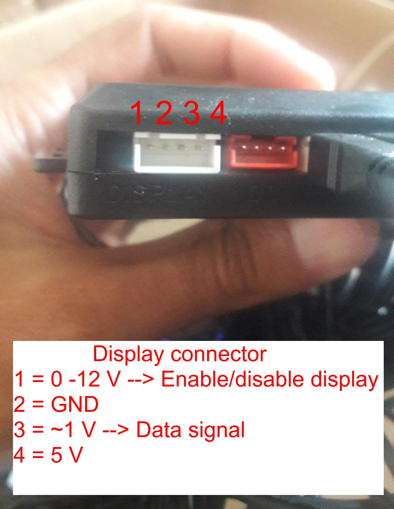
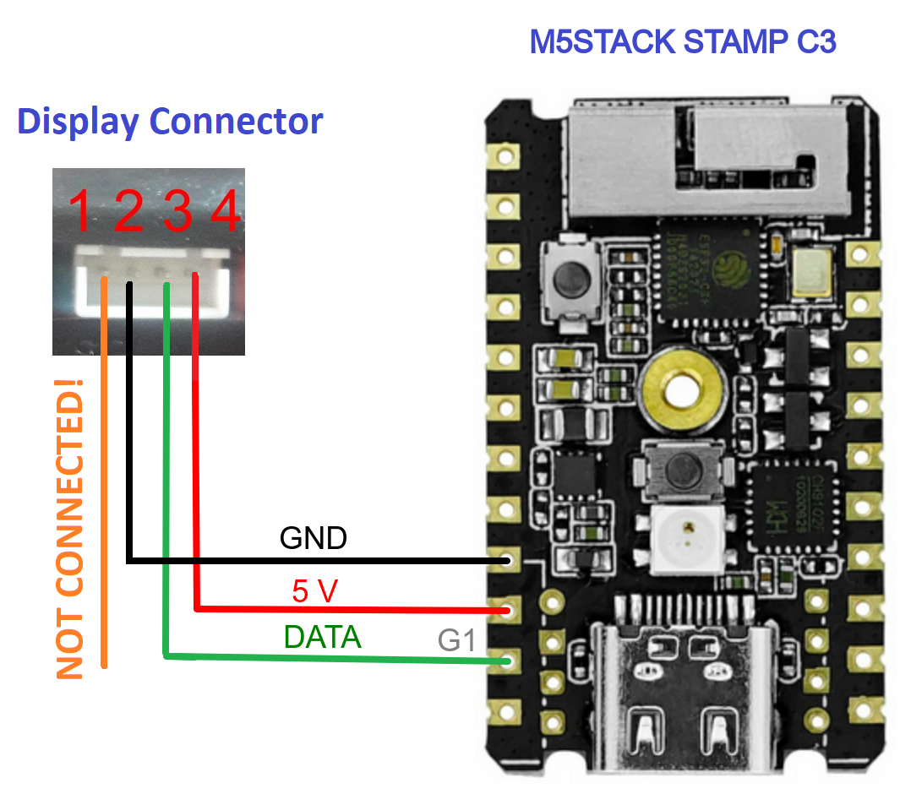
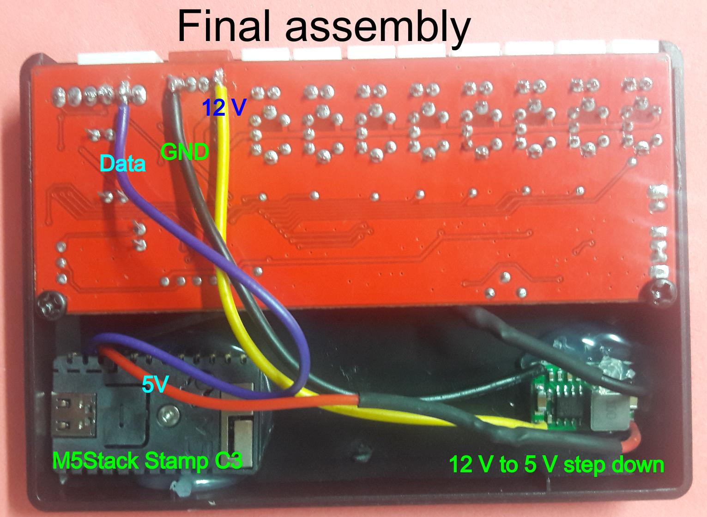
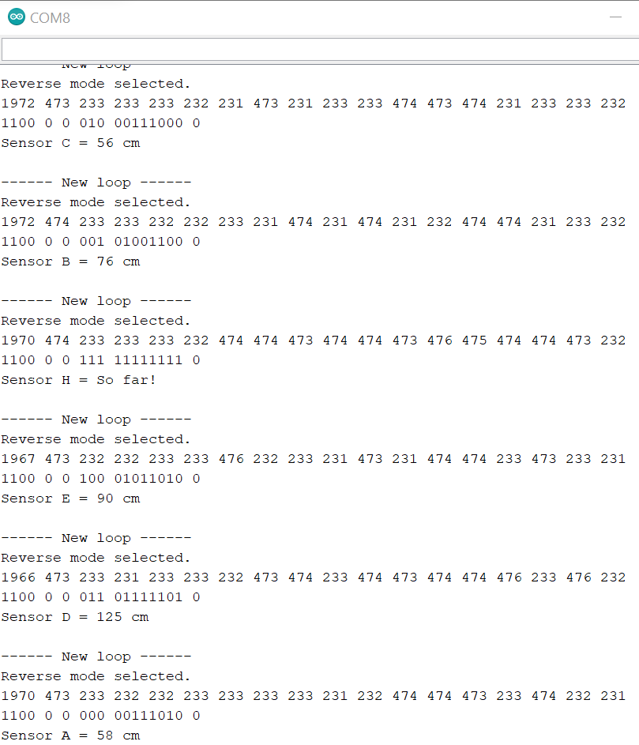
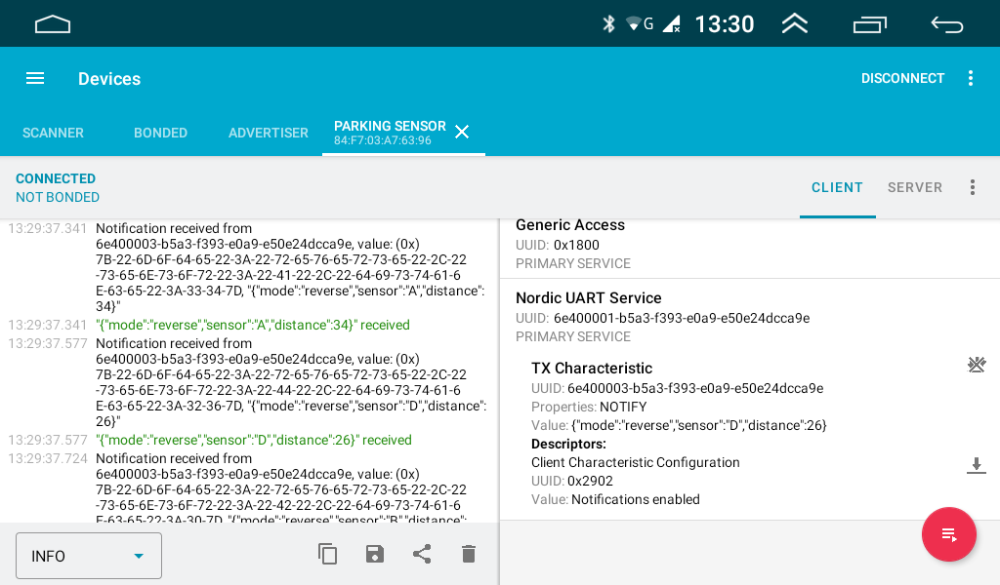

This is my attempt to show how I did to hack a particular chinese parking sensor model.

Firstly I no ittention to make a code compatible with every chinese parking sensor available on market.

The [parking sensor](https://www.aliexpress.com/item/1005001570169898.html) I bought from a seller called [Nuoyun or QXNY](https://nuoyun.aliexpress.com/store/915639) on Aliexpress.

The model is not the cheapest available on Aliexpress but I like the display model. Moreover using a very specific model can help users to always buy a compatible parking sensor.

 
All that I have done was based on experiences of other people that I have found over the internet.

The main reference that I have used was the code provided in [Arduino forum](https://forum.arduino.cc/t/hacking-car-reverese-parking-sensors/171696/10) by Dan Lavin. 

<h3>I'm looking for help from Android developers.</h3>

For more information check this topic in [XDA forum](https://xdaforums.com/t/parking-sensor-interface-for-head-unit.4428251).

I have created a repository for Android App [here](https://github.com/FernandoGarcia/ParkingSensorApp).

